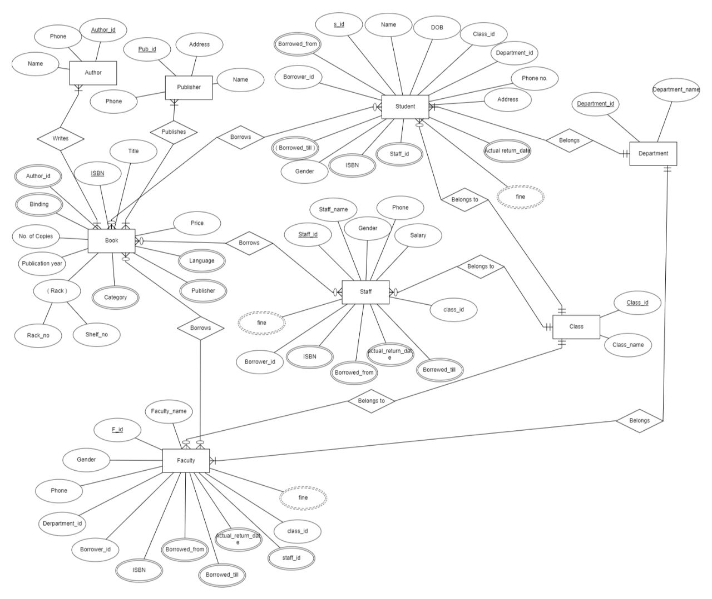
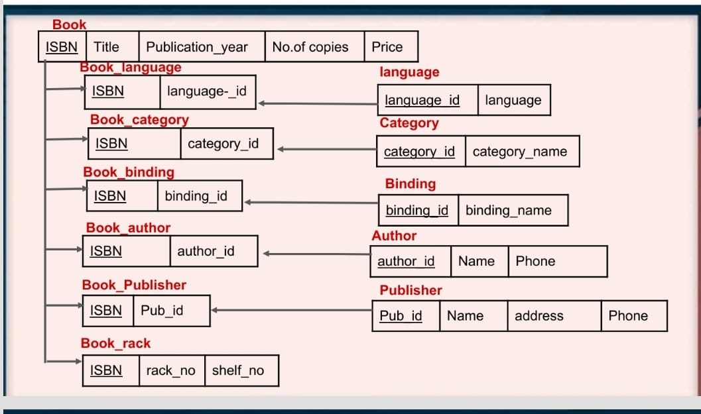

# A Library Management System Design
- The ER diagram represents the Design of a Library Management system for Educational Institutes
- The Design is built using Crow-Foot Notation
- The Design is built using multiple entities like
   - Book
   - Author
   - Publisher
   - Student
   - Staff
   - Faculty
   - Class (Status of the borrower- Represent Privileges)
   - Department
- The Design was later converted to a Relational Database which was Normalized
- In the Relational Diagram *Borrower* and *Borrower_date* are the two important tables
  - The 'Borrower' Table represents each unique instance of book borrowing (between borrower and book)
  - Since the same book can be borrowed by the user multiple times by the same borrower 'Borrower_date' was implemented to keep track of it along with the dates
 
# Folllowing are the images
 
 
 

